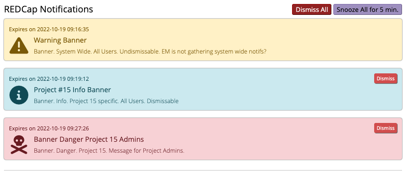
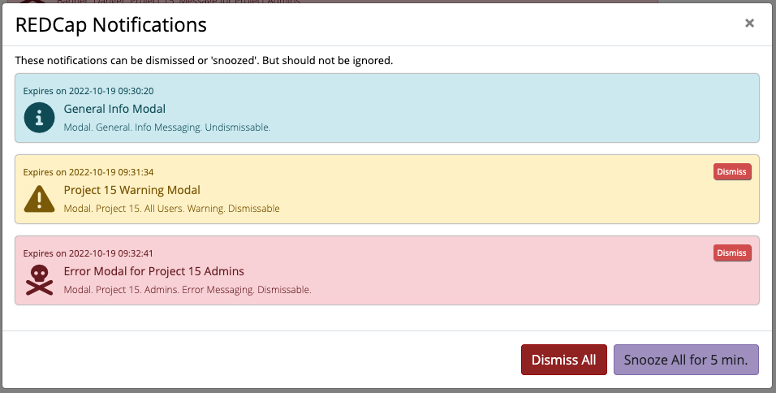

# REDCap Notifications
This REDCap EM will manage notifications displayed to REDCap users. These notifications may be project specific or system-wide
notifications.  If the notification is REDCap project specific, the notifications will only be displayed inside the
REDCap project.  If the notification is system-wide, it will be displayed on every REDCap page irregardless if users are
in a specific project.

Some notifications can be dismissed so they are not displayed any longer but others will not be dismissible. If
a notification is not dismissible, a user can snooze the notification for a short period of time but the
notification will resume once that snooze time is over.

Banner notifications will be embedded into the HTML page while modal notifications will launch a separate modal window. Unlike embedded
banner notifications which do not hinder regular REDCap work, modal notifications will require user action to continue
REDCap work.

# Notification Display Examples
Banners:

Modals:

# Notification Setup
There are two REDCap projects which are required to support this EM.  One project will store
the notification definitions, and the second REDCap project will store the dismissed notification action per user.

To keep the refresh notification process from slowing down the REDCap system, it is advised to keep the two databases
as small as possible.  Once notifications expire or are no longer active, they should be moved out of the Notifications
project. The same is true for the Dismissed Notifications project.  Once the notification is expired, the dismissed notification
actions can be moved out of the Dismissed Notification project.

There is a cron job which is currently scheduled once a day to move expired notifications and dismissed actions out of the REDCap projects.
Keeping the REDCap projects to active notifications only, will help with the server overhead (not yet created).

There are several ways notifications can be created:

    - Notifications can be manually entered through the REDCap Data Entry screens.
    - The Notification form can be made into a survey and the survey can be used to enter a new notification
    - The REDCap API can be used from outside processes to create notifications
    - A notification class will be created which can be used by other EMs (not yet created)

# How it works

On every page load.  The Notifications EM will inject a client side controller class (notifs.js + supporting files) into the html.

On initialization the controller will first check the browser's LocalStorage for a cached Notifications payload which contains all current and future Notifications for the current User (if any) using the key ["redcapNotifications" + _USER].

The controller will then parse the Notifications payload to display any system-wide or project specific notifications in the proper context for the current User.

The Notifications payload is timestamped.  On each interval of the refreshNotifs() polling function, the delta between the client's offset local time and the cached payload's last updated timestamp is evaluated.  If the delta is *greater than the default refresh limit of 6 hours, a new Notifications payload will be requested from the server and replace the current cache.
In some circumstances an immediate update is required and can be initiated from the REDCap Notifications project (by checking ["force_refresh"] in the record for the Notification).  The main EM will monitor an EM system-settings flag to determine if the refresh limit shall be *over-ridden.

Some notification are "dismissable".  For those notifs, a "dismiss" button will be presented.  If pressed, the controller updates the UI accordingly and caches the dismissed notification in a dismissed notification list/queue.  At regular
intervals, the dismissed notification list will be sent back to the server in batch and stored in the Notification Dismissed project to be excluded from the user's future Notifications payloads.

## Notification Definitions
The REDCap notification project has the following fields which will create one notification

- **record_id** - unique ID for each notification.  This can default to numeric numbers or you can enter unique values
- **note_create_time** - Timestamp when notification is created
- **note_last_update_time** - This value is updated each time the notification is updated. This is automatically updated in code and should not be manually updated.
- **note_name** - unique name of each notification.  If several notifications can be created for the same issue, the same notification name should be used.
This will prevent the same notification from being displayed multiple times. Please note: if record_ids 2 and 3 have the same notification name and both are active
at the same time, only record_id 2 notification will be displayed. But, if the notification is dismissable and it is dismissed by the
user, then the notification for record_id 3 will be added as long as it is still active.  So, the user will have to dismiss the notification
again but it is technically a different notifcation. (should we change this?)
- **note_project_id** - For project based notifications, the project id is entered.  If no value is entered, the notification
defaults to a system notification
- **note_user_types** - the options currently include: All Users, Project Admins and Designated Contacts.  If the notification is
a system notification and the user type selected is Project Admins, all Project Admins on any project will receive the display.  If the notification
is a project based notification and Project Admins is selected, then only Project Admins for that project will receive the display.
- **project_exclusion** - The project exclusion list is valid for system notifications.  If a system notification should exclude a few projects,
those project_ids can be added to this exclusion list.
- **project_status** - Notifications can be targeted to projects that are in Development Mode only or Production Mode only.  If neither
are selected, then the notification will be applied to all projects.
- **note_display** - This field defines which pages display the notification.  The notification can be displayed on
system only pages, project only pages or surveys or any combination of those pages.
- **note_type** - This field determines if the notification will be embedded in the html page as a banner or if
it will be displayed in a separate modal window.
- **note_dismiss** - This field determines if the notification is dismissible by the user
- **note_alert_status** - This field determines if the notification is Informational only, a Warning or an Error.  The colors of
the notification are < TODO: > for Info, < TODO: > for Warning and < TODO: > for Error
- **note_icon** - The icon used for the notification can be customized.  The default icons are < TODO: > for Info,
< TODO: > for warning and < TODO: > for error.  If an icon URL is specified, that icon will be used instead.
- **note_start_dt** - Start date/time when the notification should be displayed
- **note_end_dt** - End date/time when the notification expires
- **note_creator** - Name of person or process creating the notification
- **note_subject** - Short subject line of notification
- **note_message** - Notification body that will be displayed
- **force_refresh** - Checkbox if this notification (or change of notification) should go into effect immediately.
- **notifications_complete** - form status.  Notification is considered active when form status is Complete (2). Otherwise the
notification is considered Inactive and will not be displayed.

## Notification Dismissed Definitions

- **record_id** - Numerically increasing record_id
- **note_record_id** - Record ID of the notification in the Notifications project that the user is dismissing
- **note_name** - Name of the notification the user is dismissing
- **note_username** - User ID of the person dismissing the notification
- **note_dismissal_datetime** - Timestamp when the user dismissed the notification
- **note_dismissed_stored_time** - Timestamp when the dismissal is stored in REDCap
